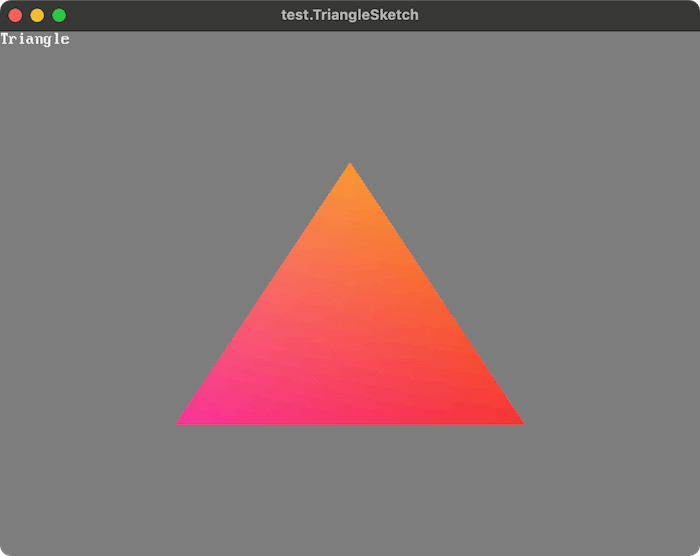

# LWJGL BGFX Studies



My studies of the BGFX library using the LWJGL3.

(Mainly scratches for understanding and implementations of [processing-lwjgl-bgfx](https://github.com/funatsufumiya/processing-lwjgl-bgfx))

## Compiling Shaders

- firstly, install bgfx-tools from [for mac](https://www.lwjgl.org/browse/release/3.3.5/macosx/arm64/bgfx-tools), [for win](https://www.lwjgl.org/browse/release/3.3.5/windows/x64/bgfx-tools) or [for linux](https://www.lwjgl.org/browse/release/3.3.5/linux/x64/bgfx-tools)
    - after downloading, please copy `shaderc` to `PATH` directory
    - (for windows, please use git bash)

```bash
bash ./scripts/compile_shaders.sh
```

## Run

### Basic

```bash
./gradlew buildExample
./gradlew runHelloBGFX
```

### Sketch style hello world

```bash
./gradlew buildExample
./gradlew runHelloSketch
```

### Triangle

```bash
./gradlew buildExample
./gradlew runTriangleSketch
```

## Acknowledgements

This project is mainly based on the following projects (mixtures of them):

- https://github.com/funatsufumiya/hello_bgfx_triangle (applying latest update from https://thatonegamedev.com/cpp/hello-bgfx/, based on https://github.com/Paper-Cranes-Ltd/big2-stack)
- https://github.com/LWJGL/lwjgl3-demos